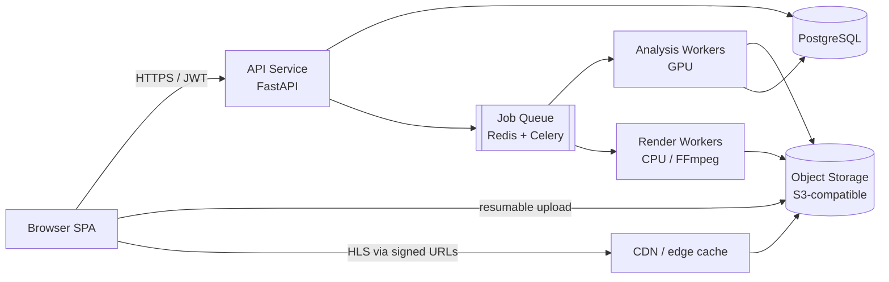

# Halal-Compliant Video Filtering Platform

## Product & Engineering Specification — v1.0

| | |
|---|---|
| **Working title** | *Naqī* (نقي, "pure") — placeholder, final name TBD |
| **Document status** | Draft for dev team review |
| **Date** | July 2026 |
| **Owner** | Youssef El Fhayel |
| **Scope of this release** | Visual intimate-content filtering only (nudity, sexual content, kissing, intimacy, bed/suggestive scenes) |

---

## 1. Executive Summary

A web platform where a user uploads a video (typically a film or series episode), the system automatically detects visually intimate content — nudity, sexual activity, kissing, intimate contact, and suggestive/bed scenes — and the user then either **streams the video with those scenes seamlessly removed** or **downloads a filtered copy**. The user selects a strictness level (or fine-tunes individual categories) that determines what gets removed.

The product serves Muslim viewers who want to watch mainstream film and TV content in a way that is compliant with their values. Comparable products (VidAngel, ClearPlay) target the US Christian market and rely on licensing deals with studios; this product is **user-upload based**, detection-driven, and tuned to Islamic content standards.

**Core design principle: recall over precision.** A missed intimate scene is a product-killing failure for this audience; an over-flagged scene is a minor annoyance the user can un-flag in the review UI. Every threshold, default, and UX decision follows from this.

**Architecture in one sentence:** analyze once → store timestamped category detections → generate any strictness level from the same analysis without re-scanning → deliver via filtered HLS stream (watch) or re-encoded file (download).

---

## 2. Problem Statement & Goals

### 2.1 Problem

Practicing Muslim individuals and families widely avoid mainstream film/TV or watch it with discomfort because intimate scenes are unpredictable and unavoidable. Manual workarounds (skipping manually, pre-reading parental guides on IMDb/Common Sense Media) are unreliable and ruin the viewing experience. No existing product combines automated detection, Islamic-oriented category definitions, and user-owned content.

### 2.2 Product goals (v1)

1. A user with no technical skill can upload a video, pick a level, and watch a filtered version in the browser within one processing cycle.
2. Detection recall on explicit content (sex acts, explicit nudity) is high enough that users trust the product for family viewing.
3. The review UI lets a cautious user verify and adjust every flagged segment **without being forced to view the flagged content** (blurred thumbnails by default).
4. All content and viewing data is private by default with clear retention and deletion guarantees.

### 2.3 Success metrics

| Metric | Target at private beta | Notes |
|---|---|---|
| Explicit-content leakage (C1+C2) | < 2 seconds of missed content per viewing hour on the golden film set | The headline quality metric |
| Shot-level recall, C1/C2 | ≥ 98% | Measured on golden dataset |
| Shot-level recall, C4 (kissing) | ≥ 92% | Hardest visual category |
| Analysis speed | ≤ 0.5× realtime on 1 GPU (2 h film ≤ 60 min) | |
| Render speed (download) | ≤ 0.35× realtime | |
| User trust proxy | ≥ 80% of beta users complete a second video | |

---

## 3. Scope

### 3.1 In scope (v1)

- Visual detection and removal of: explicit sexual activity, explicit nudity, partial nudity/revealing attire (optional category), kissing, intimate physical contact, suggestive/bed scenes.
- Web application: upload, analysis, review, streaming playback with filtered scenes removed, filtered download.
- Strictness levels + per-category custom configuration.
- User accounts, video library, privacy controls, deletion.
- Live-action content. (Animation/anime support is a known limitation — see Risks §14.)

### 3.2 Out of scope (v1) — future roadmap items

- Audio filtering: profanity muting, music removal (§15).
- Other categories: violence, alcohol, drugs, blasphemous dialogue.
- Mobile native apps, TV apps, browser extension for streaming services.
- DRM-protected sources (Netflix downloads etc. — technically and legally infeasible).
- Any redistribution or sharing of filtered files between users (legal review required first — see §15).

---

## 4. Content Taxonomy & Filtering Levels

This taxonomy is the contract between product, ML, and QA. The annotation guide (§12) must define each category with visual examples.

### 4.1 Categories

| ID | Category | Definition (summary) | Primary detection method |
|---|---|---|---|
| **C1** | Explicit sexual activity | Any depiction of sex acts, simulated or real, clothed or not | NSFW classifier (frame) + video action model on borderline shots |
| **C2** | Explicit nudity | Exposed genitalia, female breasts, buttocks | Body-part detector (NudeNet-class) |
| **C3** | Partial nudity / revealing attire | Lingerie, swimwear, shirtless scenes, highly revealing clothing | Body-part detector with "covered" classes + CLIP prompts |
| **C4** | Kissing | Lip-to-lip kissing. Sub-flag: brief peck vs. prolonged | CLIP/SigLIP zero-shot + video action model (Kinetics "kissing" class) |
| **C5** | Intimate physical contact | Romantic embracing, caressing, lying together, lap sitting | CLIP/SigLIP zero-shot prompt ensemble |
| **C6** | Suggestive / bed scenes | Implied sex (before/after framing), undressing, seductive dance | CLIP prompt ensemble + shot context (adjacent to C1/C4 hits) |

### 4.2 Strictness levels

Levels are **pure configuration** over the same analysis output. Adding/changing a level never requires re-analysis.

| Category | Level 1 — Essential | Level 2 — Moderate (default) | Level 3 — Strict |
|---|---|---|---|
| C1 Explicit sexual activity | Remove | Remove | Remove |
| C2 Explicit nudity | Remove | Remove | Remove |
| C3 Partial nudity / attire | Keep | Keep | Remove |
| C4 Kissing | Keep | Remove | Remove |
| C5 Intimate contact | Keep | Keep | Remove |
| C6 Suggestive / bed scenes | Keep | Remove | Remove |

Plus **Custom**: per-category on/off + a sensitivity slider per category (Low/Med/High → maps to detection thresholds). The settings matrix must respect that strictness varies between individuals and schools of thought — the three presets are starting points, not doctrine.

### 4.3 Actions

v1 supports one action: **cut** (segment removed entirely, audio included). Blur and audio-only-mute are explicitly deferred — cutting is the only action that guarantees zero exposure, which matches the recall-first principle.

---

## 5. User Stories & Functional Requirements

### 5.1 Primary user stories

1. As a viewer, I upload a film, choose Level 2, and watch it in the browser with all flagged scenes seamlessly skipped.
2. As a viewer, I download a filtered MP4 to watch offline / on my TV.
3. As a cautious parent, I review every flagged segment (blurred thumbnails, timestamps, confidence, duration) and confirm or adjust before family movie night.
4. As a user, I report a scene the system missed by marking a time range; it is added to my cut list immediately and logged as model feedback.
5. As a privacy-conscious user, I delete a video and receive confirmation that the file and all derived data are gone.

### 5.2 Functional requirements

| ID | Requirement |
|---|---|
| FR-1 | **Upload**: MP4/MKV/AVI/MOV/WebM; up to 10 GB / 4 h in v1; chunked + resumable (tus protocol or S3 multipart); virus scan on completion. |
| FR-2 | **Analysis job**: async, with progress states (`queued → probing → sampling → detecting → aggregating → ready`) and ETA; user can leave and return. |
| FR-3 | **Level selection**: user picks preset or custom config; can change level *after* analysis with no re-processing. |
| FR-4 | **Review screen**: horizontal timeline with flagged segments color-coded by category; per-segment card (blurred thumbnail — click/hold to reveal with confirmation, category, confidence, duration); toggle include/exclude; drag to adjust boundaries; "add manual segment" tool. |
| FR-5 | **Watch mode**: in-browser player streams the filtered version; flagged segments are absent from the stream itself (see §8 — no client-side skipping of a full stream). |
| FR-6 | **Download**: rendered MP4 (H.264/AAC) per selected level/custom config; render is async with notification. |
| FR-7 | **Library**: list of user's videos, analysis status, per-video level memory, re-download previous renders while retained. |
| FR-8 | **Feedback loop**: "report missed scene" and "wrongly flagged" actions; stored with video hash + time range + category for model improvement (opt-in for using content in training — default OFF). |
| FR-9 | **Account & privacy**: signup/login, storage quota, per-video and account-level deletion, data export. |
| FR-10 | **Admin**: internal dashboard for job monitoring, error triage, aggregate (non-content) metrics. |

### 5.3 Explicit non-requirements (v1)

No social features, no sharing, no public library, no comments, no recommendations.

---

## 6. System Architecture



### 6.1 Components

| Component | Tech recommendation | Notes |
|---|---|---|
| Frontend | React + Next.js, Tailwind, hls.js for playback | SPA with SSR for marketing pages |
| API | Python 3.12, FastAPI, Pydantic v2 | Single service in v1; JWT auth (or managed auth: Clerk/Auth0) |
| Queue | Redis + Celery (separate `gpu` and `cpu` queues) | Swappable for SQS/Cloud Tasks later |
| Analysis workers | Python, PyTorch, containerized, 1 GPU each (T4/L4/RTX 4090 class) | Autoscale 0→N on queue depth |
| Render workers | FFmpeg 6+, CPU instances | Horizontally scalable |
| Storage | S3-compatible (AWS S3 / Cloudflare R2 / MinIO for self-host) | Buckets: `uploads`, `mezzanine`, `analysis`, `renders` |
| DB | PostgreSQL 16 | |
| Observability | OpenTelemetry + Grafana/Prometheus; Sentry for errors | Per-stage timing metrics from day one |
| Deployment | Docker Compose (dev) → Kubernetes or ECS (prod) | GPU node pool separate from web pool |

### 6.2 Processing flow

1. Client requests upload → API returns multipart/tus target → client uploads to object storage directly.
2. Upload complete → API enqueues `analyze(video_id)`.
3. Analysis worker: probe → mezzanine transcode → sampling → detection → aggregation → writes `shots`, `detections`, `segments` to DB + `analysis.json` to storage → status `ready`.
4. User reviews/adjusts → API stores per-user segment overrides.
5. **Watch**: API (or a small packager step) generates the filtered HLS playlist for the chosen config → player streams it.
6. **Download**: `render(video_id, config)` job → FFmpeg cut+concat → file in `renders` → signed URL.

---

## 7. Detection Pipeline Specification

This is the heart of the product. Build it as a standalone, CLI-runnable Python package (`analyzer/`) that the worker wraps — this makes evaluation (§12) and local iteration fast.

### 7.1 Stage A — Probe & normalize

- `ffprobe` → duration, resolution, fps, codecs; reject/flag unsupported or corrupt files.
- Transcode a **mezzanine**: H.264, CRF 20, `-force_key_frames` every 2 s (playback segmentation depends on this — see §8.1), audio AAC passthrough/normalize. Original upload is retained until analysis succeeds, then per retention policy.

### 7.2 Stage B — Shot boundary detection

- Primary: **TransNetV2** (learned shot detector, robust to fades/dissolves). Fallback/simpler: PySceneDetect `ContentDetector`.
- Output: list of shots `(start_time, end_time)`. All flagging and cutting snaps to shot boundaries — cutting mid-shot looks broken; cutting at shot boundaries looks like an editorial choice.

### 7.3 Stage C — Frame sampling (two-pass)

- **Pass 1**: uniform 1 fps across the whole video; every shot gets ≥ 3 frames (short shots sampled denser).
- **Pass 2 (borderline re-sampling)**: any shot whose max category score lands in the "uncertain band" (e.g. 0.35–0.65) is re-sampled at 4 fps and re-scored. This is the specific fix for **quick kisses** that a 1 fps pass straddles.

### 7.4 Stage D — Per-frame / per-shot inference

| Model slot | Recommended model | Task | License note |
|---|---|---|---|
| NSFW frame classifier | `Falconsai/nsfw_image_detection` (ViT) or equivalent | C1/C2 coarse score per frame | Apache-2.0 — verify at build time |
| Body-part detector | **NudeNet v3 detector** | C2/C3 fine-grained (exposed vs covered classes, per-part) | Verify license for commercial use |
| Zero-shot frame scorer | **SigLIP** (or OpenCLIP ViT-L) | C4/C5/C6 via prompt ensemble | Apache-2.0 / MIT |
| Video action model (borderline only) | **X-CLIP** or VideoMAE fine-tuned on Kinetics-400 | C4 confirmation ("kissing" is a Kinetics class), C1 motion cues | Verify |

Prompt-ensemble sketch for SigLIP (tune on golden set, keep in config not code):

- C4 positives: "two people kissing on the lips", "a romantic kiss close-up" · negatives: "two people talking", "people hugging goodbye at an airport"
- C5 positives: "a couple embracing romantically", "a man and woman lying together in bed", "caressing a partner's face" · negatives: "a parent hugging a child", "friends greeting"
- C6 positives: "a seductive scene in a bedroom", "a person undressing", "the morning after, couple in bed under sheets"

Score = softmax over positive vs negative prompt sets, max over positives.

**Cost control**: frame models (cheap) run everywhere; the video action model (expensive) runs only on shots the frame models mark borderline for C1/C4. Expected inference budget for a 2 h film: ~7,200 base frames + ~15–25% re-sampled ≈ well within the 0.5× realtime target on one modern GPU with batched inference (batch 32–64, fp16).

### 7.5 Stage E — Aggregation & rules engine

- **Shot score per category** = mean of top-3 frame scores in the shot (robust to one noisy frame, sensitive to brief content).
- **Hysteresis**: once a shot exceeds threshold *T*, adjacent shots are also flagged while their score ≥ 0.6 × *T* (captures lead-in/lead-out of a scene).
- **Rules engine** reads `rules.yaml` (Appendix A): per level, per category → threshold + action. Output: machine segment list.
- **Post-processing**: snap to shot boundaries → pad ±0.5 s → merge segments separated by < 2.0 s → drop segments < 0.5 s *unless* category is C1/C2 (never drop explicit hits).
- **C6 context rule**: shots adjacent to a confirmed C1 segment get a C6 score boost (+0.15) — implied-sex framing usually sits next to the explicit shot.

### 7.6 Analysis output contract

Single source of truth per video: `analysis.json` (Appendix B) + normalized rows in DB. Contains shots, per-shot per-category scores, machine segments with model provenance, pipeline version. **Versioned**: `pipeline_version` string on every artifact so re-analysis after model upgrades is diffable.

### 7.7 Starting thresholds (to be tuned in M1 — do not ship untuned)

| Category | Threshold (Med sensitivity) | Bias |
|---|---|---|
| C1 | 0.55 | Recall-biased |
| C2 | 0.50 | Recall-biased |
| C3 | 0.70 | Precision-biased (opt-in category) |
| C4 | 0.60 | Balanced |
| C5 | 0.65 | Balanced |
| C6 | 0.65 | Balanced |

Low/High sensitivity = ±0.10 on these values.

---

## 8. Rendering & Playback Specification

### 8.1 Watch mode — filtered HLS (key architectural decision)

**Do not ship a full video to the client with a JS "skip list".** Client-side seeking can flash a frame of flagged content before the jump — for this audience that is a hard product failure. Instead:

1. Mezzanine is segmented into HLS/CMAF chunks (2 s), with **additional forced keyframes at every segment boundary from the analysis**, so chunk edges align exactly with cut points.
2. For a given filter config, the API generates a **playlist that simply omits the chunks inside flagged ranges** (with `#EXT-X-DISCONTINUITY` markers at each cut).
3. Player (hls.js / native Safari HLS) plays the playlist — flagged content never reaches the client. Changing level = regenerating a text playlist, which is instant and free.
4. All media URLs are short-lived signed URLs scoped to the owning user.

This delivers the "analyze once, any level instantly" property end-to-end with zero re-encoding for playback.

### 8.2 Download mode — re-encoded file

- FFmpeg `filter_complex` trim + concat of **kept** ranges, single re-encode pass (H.264 CRF 20, AAC). Frame-accurate, no smart-cut complexity in v1 (note as later optimization).
- **Audio at cut points**: apply 150 ms `afade` in/out around each junction (or `acrossfade` between kept ranges) to eliminate pops and hard music cuts.
- Output named `{title}.filtered.L{level}.mp4`, stored in `renders`, retained per policy.

### 8.3 Player requirements

- Show "n scenes removed · mm:ss total" badge; optional subtle marker on the seekbar where cuts occurred (toggleable — some users prefer not to know).
- Resume position, keyboard shortcuts, subtitle passthrough (`.srt` upload in v1; embedded-subs extraction is a stretch goal — note subtitles are **not** re-timed across cuts in HLS mode since the timeline collapses naturally with omitted chunks; for downloads, re-time by subtracting removed duration — implement and test).

---

## 9. API Specification (v1 surface)

Base: `/api/v1`, JWT bearer auth, JSON. Uploads and media bypass the API via signed URLs.

| Method & path | Purpose |
|---|---|
| `POST /videos` | Create video record → returns upload target (multipart/tus) |
| `POST /videos/{id}/complete` | Client signals upload done → triggers virus scan + analysis enqueue |
| `GET /videos` / `GET /videos/{id}` | Library / detail incl. analysis status + progress |
| `GET /videos/{id}/segments?config=…` | Machine segments + user overrides resolved for a config |
| `PATCH /videos/{id}/segments` | User overrides: include/exclude, boundary edits, manual additions |
| `PUT /videos/{id}/filter-config` | Save chosen level / custom category config |
| `GET /videos/{id}/playback?config=…` | Returns filtered HLS master playlist URL (signed) |
| `POST /videos/{id}/renders` | Enqueue download render for a config |
| `GET /renders/{id}` | Render status + signed download URL |
| `POST /videos/{id}/feedback` | Missed-scene / false-flag reports |
| `DELETE /videos/{id}` | Hard delete video + all derivatives (async purge, confirmation event) |
| `GET /account` / `DELETE /account` | Profile, quota, full account deletion |

Error model: RFC 7807 problem+json. Rate limits on upload creation and render creation.

---

## 10. Data Model (PostgreSQL)

| Table | Key columns |
|---|---|
| `users` | id, email, auth fields, quota_bytes, created_at, deleted_at |
| `videos` | id, user_id, title, status (`uploading/scanning/analyzing/ready/failed`), duration_s, source_meta jsonb, storage keys, pipeline_version, created_at |
| `analysis_jobs` | id, video_id, state, progress_pct, stage, error, timings jsonb, worker_id |
| `shots` | id, video_id, idx, start_s, end_s |
| `detections` | id, shot_id, category (C1..C6), score, model, model_version, sampled_fps |
| `segments` | id, video_id, category, start_s, end_s, score, origin (`machine/user`), pipeline_version |
| `segment_overrides` | id, video_id, user_id, segment_id nullable, action (`exclude/include/adjust/manual_add`), start_s, end_s, category |
| `filter_configs` | id, video_id, user_id, preset (`L1/L2/L3/custom`), categories jsonb (per-category on/off + sensitivity) |
| `renders` | id, video_id, config snapshot jsonb, state, storage_key, size_bytes, expires_at |
| `feedback` | id, video_id, user_id, type (`missed/false_flag`), category, start_s, end_s, note, training_consent bool |

Retention fields (`expires_at`, `deleted_at`) on every content-bearing table; a nightly purge job enforces them.

---

## 11. Non-Functional Requirements

**Performance.** Analysis ≤ 0.5× realtime/GPU; playlist generation < 500 ms; render ≤ 0.35× realtime; UI TTI < 3 s.

**Scalability.** Stateless API; workers autoscale on queue depth; storage and DB are the only stateful pieces. Target for beta: 50 concurrent analyses without queue starvation of small jobs (use size-based queue priority).

**Privacy — elevated bar for this product.** What a user filters implies religious belief — under GDPR this is special-category-adjacent data. Therefore: (a) no behavioral analytics tied to content categories per identified user; (b) content encrypted at rest (SSE) and in transit; (c) staff never view user content — debugging uses metadata only; any exception requires explicit user consent per incident; (d) default retention: originals 30 days, renders 14 days, analysis metadata until video deletion — all user-configurable downward; (e) deletion is hard deletion of all derivatives within 24 h, confirmed to the user; (f) feedback clips used for model training **only** with explicit opt-in (default off).

**Security.** Signed short-lived media URLs bound to user; malware scan on ingest (ClamAV); FFmpeg/probing sandboxed (containerized, resource-limited — media parsers are an attack surface); OWASP ASVS L2; dependency and container scanning in CI.

**Legal.** Positioning: users may upload only content they lawfully possess for personal/private use; no redistribution features; ToS + notice-and-takedown process. Copyright treatment of personal-use filtering varies by jurisdiction (Morocco, EU, GCC targets) — **engage counsel before public launch; this document is not legal advice.** The US Family Movie Act precedent covers filtering *playback*, not distributing filtered copies — the download feature needs specific review.

**Accessibility & i18n.** UI in English, French, Arabic (RTL) from v1 — the audience demands it. WCAG 2.1 AA for core flows.

---

## 12. Evaluation & QA Plan

**Golden dataset (build in M0 — blocks everything downstream).**

- ~60 clips (10–60 s) covering every category incl. hard negatives (parent-child affection, greetings, beach documentary, medical scenes, dark/low-light intimate scenes) + ~15 fully clean clips.
- 4 full feature films spanning genres, each fully annotated.
- Written **annotation guide** with per-category visual definitions and edge-case rulings (cheek kiss? breastfeeding? classical art nudity?); 2 annotators, adjudicate disagreements; store labels in the same `segments` schema.

**Metrics (automated harness, runs in CI on every threshold/model/prompt change).**

- Per category: shot-level precision/recall; segment boundary IoU.
- **Leakage**: seconds of ground-truth content NOT covered by machine segments, per viewing hour — the release-gating number (C1+C2 target < 2 s/h).
- Over-cut rate: seconds of clean content removed per hour (UX cost metric).

**Release gates.** M1 exit: leakage and recall targets met on clips. M4 exit: targets met on the 4 golden films end-to-end through the real pipeline, plus zero P0/P1 bugs in upload→watch→download flow.

**Beta.** 20–30 target-audience testers; instrument feedback reports as the ongoing quality signal; weekly triage of `missed` reports (each one is a potential trust breach — treat as bugs, not data points).

---

## 13. Delivery Plan & Milestones

**Team (recommended):** 1 ML engineer, 2 backend, 1 frontend, 1 product/design (0.5), 1 QA (0.5). ~13 weeks to private beta.

| Milestone | Weeks | Deliverables | Exit criteria |
|---|---|---|---|
| **M0 — Foundations** | 1–2 | Golden dataset + annotation guide; repo/CI/infra skeleton; walking skeleton (upload → dummy job → status) | Dataset labeled & adjudicated; deploy pipeline green |
| **M1 — Detection core** | 3–6 | `analyzer/` CLI (probe→shots→two-pass sampling→models→rules→analysis.json); eval harness; threshold tuning | §12 clip-level targets met; ≤ 0.5× realtime |
| **M2 — Delivery paths** | 6–9 | Mezzanine+HLS segmentation aligned to cuts; playlist generator; FFmpeg render worker with audio fades; API + DB + auth; job orchestration | Filtered stream & download for a full film, cuts clean at boundaries, audio pop-free |
| **M3 — Product UI** | 8–11 | Upload/library/progress; review timeline with blurred thumbnails, toggles, boundary editing, manual segments; player; download flow; AR/FR/EN | End-to-end usable by non-technical tester without help |
| **M4 — Hardening & beta** | 12–13 | Privacy/retention/deletion jobs; observability + alerts; load test; security pass; golden-film release gate; beta onboarding | §12 film-level gates; deletion verified; beta live |

Parallelization: M1 (ML) and M2 (backend) overlap weeks 6; M3 starts against mocked API week 8.

---

## 14. Risks & Mitigations

| Risk | Impact | Mitigation |
|---|---|---|
| Missed explicit scene reaches a family screening | Critical — trust destroyed | Recall-biased thresholds; hysteresis; two-pass sampling; review UI framed as verification step; leakage release gate; missed-scene reports treated as P1 bugs |
| Kissing recall plateaus (fast pecks, unusual angles, low light) | High | Video action model on borderline shots; 4 fps re-sampling; grow fine-tuning set from opted-in feedback |
| Animation/anime content — models degrade badly | Medium | v1: detect animated content (cheap classifier) and warn "reduced accuracy"; roadmap: anime-specialized NSFW model |
| Dark/low-light scenes reduce detector accuracy | Medium | Include in golden set; brightness-normalize sampled frames; flag low-confidence dark shots for denser sampling |
| GPU cost per video at scale | Medium | Two-stage cheap→expensive inference; batching + fp16; spot GPU instances; per-video cost dashboard from M2 |
| Copyright exposure (esp. download feature) | High | Personal-use ToS, no sharing, counsel review pre-launch (§11); ship watch-only if counsel flags downloads |
| Model licenses unfit for commercial use | Medium | License audit task in M0 for every model in §7.4; swap candidates identified |
| Media parsing attack surface (malicious uploads) | Medium | Sandboxed FFmpeg, resource limits, virus scan, no server-side rendering of user metadata |

---

## 15. Future Roadmap (post-v1, priority order)

1. **Audio profanity** — Whisper transcript + multilingual wordlist → timestamped mutes/bleeps (extends rules engine naturally).
2. **Music handling** — Demucs stem separation: strip music, keep dialogue; optional nasheed/ambient replacement track. Major differentiator for the strict tier.
3. **Community filter tracks** — once one user reviews film X, others with the same file (fingerprint match) get the verified cut list instantly. Enormous value + moat; **requires legal review** (this is where VidAngel got sued — sharing edit *timelines* is very different from sharing *content*, but get counsel's sign-off first).
4. Additional categories: alcohol/drugs (object detection), optional violence tiers.
5. Anime-specialized detection models.
6. Mobile apps (playback of user's filtered library), TV casting.
7. B2B API (Islamic streaming platforms, schools, airlines in Muslim-majority markets).

---

## 16. Open Questions (decide before/at M0 kickoff)

1. Default ruling for cheek kisses and parent-child affection in the annotation guide (recommend: not flagged; C4 = lip kissing only).
2. Is C3 (revealing attire) in the v1 UI or hidden behind "advanced"? (Recommend: present but off by default outside Level 3.)
3. Hosting posture: EU cloud, GCC cloud, or self-host-friendly (MinIO) for privacy positioning?
4. Monetization for beta: free with quota (e.g. 3 videos/month) → subscription tiers by processing hours?
5. Do we watermark downloads (deters redistribution, supports legal posture) at the cost of UX?
6. Target launch jurisdictions for the counsel review (Morocco + which EU/GCC markets?).

---

## Appendix A — `rules.yaml` (shape)

```yaml
pipeline_version: "1.0.0"
sensitivity_offsets: { low: +0.10, medium: 0.0, high: -0.10 }

categories:
  C1: { name: explicit_sexual_activity, base_threshold: 0.55, min_segment_s: 0.0, never_drop: true }
  C2: { name: explicit_nudity,          base_threshold: 0.50, never_drop: true }
  C3: { name: partial_nudity_attire,    base_threshold: 0.70 }
  C4: { name: kissing,                  base_threshold: 0.60 }
  C5: { name: intimate_contact,         base_threshold: 0.65 }
  C6: { name: suggestive_bed_scene,     base_threshold: 0.65, context_boost_near: [C1], boost: 0.15 }

post_processing:
  snap_to_shots: true
  pad_s: 0.5
  merge_gap_s: 2.0
  hysteresis_ratio: 0.6

levels:
  L1: { C1: cut, C2: cut }
  L2: { C1: cut, C2: cut, C4: cut, C6: cut }
  L3: { C1: cut, C2: cut, C3: cut, C4: cut, C5: cut, C6: cut }
```

## Appendix B — `analysis.json` (shape)

```json
{
  "video_id": "vid_8f3a…",
  "pipeline_version": "1.0.0",
  "duration_s": 7182.4,
  "shots": [ { "idx": 412, "start_s": 3181.2, "end_s": 3187.9 } ],
  "detections": [
    { "shot_idx": 412, "category": "C4", "score": 0.83,
      "model": "siglip-l16", "model_version": "…", "sampled_fps": 4 }
  ],
  "segments": [
    { "id": "seg_017", "category": "C4", "start_s": 3180.7, "end_s": 3188.4,
      "score": 0.83, "origin": "machine" }
  ]
}
```

## Appendix C — Model shortlist & license audit checklist

For each model before M1 exit: exact checkpoint, license, commercial-use permission, weights redistribution terms, expected VRAM, batched fp16 throughput on target GPU. Slots: NSFW frame classifier · body-part detector (NudeNet-class) · SigLIP/OpenCLIP · TransNetV2 · X-CLIP/VideoMAE. Keep a swap candidate per slot.

---

*End of specification. Questions → document owner.*
